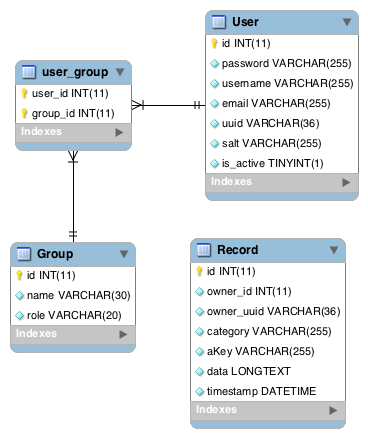

VirtualPersistAPI Entity Relationships
======================================

by Paul Mitchum, April 23, 2012

A Markdown version of this document exists here: https://github.com/paul-m/VirtualPersistAPI/blob/master/design/EntityRelationships.md

Currently...
------------

Currently there are three entities and a subsequent join table.

These are defined in PHP annotation using Doctrine ORM: http://docs.doctrine-project.org/projects/doctrine-orm/en/latest/index.html

Using Symfony's console, we can generate the SQL necessary to create this schema on the database:

	CREATE TABLE `Group` (id INT AUTO_INCREMENT NOT NULL, name VARCHAR(30) NOT NULL, role VARCHAR(20) NOT NULL, UNIQUE INDEX UNIQ_AC016BC157698A6A (role), PRIMARY KEY(id)) DEFAULT CHARACTER SET utf8 COLLATE utf8_unicode_ci ENGINE = InnoDB;
	
	CREATE TABLE Record (id INT AUTO_INCREMENT NOT NULL, owner_id INT NOT NULL, owner_uuid VARCHAR(36) NOT NULL, category VARCHAR(255) NOT NULL, aKey VARCHAR(255) NOT NULL, data LONGTEXT NOT NULL, timestamp DATETIME NOT NULL, PRIMARY KEY(id)) DEFAULT CHARACTER SET utf8 COLLATE utf8_unicode_ci ENGINE = InnoDB;
	
	CREATE TABLE User (id INT AUTO_INCREMENT NOT NULL, password VARCHAR(255) NOT NULL, username VARCHAR(255) NOT NULL, email VARCHAR(255) NOT NULL, uuid VARCHAR(36) NOT NULL, salt VARCHAR(255) NOT NULL, is_active TINYINT(1) NOT NULL, UNIQUE INDEX user_uuid (uuid), PRIMARY KEY(id)) DEFAULT CHARACTER SET utf8 COLLATE utf8_unicode_ci ENGINE = InnoDB;
	
	CREATE TABLE user_group (user_id INT NOT NULL, group_id INT NOT NULL, INDEX IDX_8F02BF9DA76ED395 (user_id), INDEX IDX_8F02BF9DFE54D947 (group_id), PRIMARY KEY(user_id, group_id)) DEFAULT CHARACTER SET utf8 COLLATE utf8_unicode_ci ENGINE = InnoDB;
	
	ALTER TABLE user_group ADD CONSTRAINT FK_8F02BF9DA76ED395 FOREIGN KEY (user_id) REFERENCES User (id) ON DELETE CASCADE;
	
	ALTER TABLE user_group ADD CONSTRAINT FK_8F02BF9DFE54D947 FOREIGN KEY (group_id) REFERENCES `Group` (id) ON DELETE CASCADE;

The main difference between this and the previous version is the addition of the `Group` entity and table, which represents access control groups. This table is joined to the `User` table through the `user_group` table, which is helpfully generated by Doctrine thanks to `@ManyToMany` annotation.

You can see the evidence of this in the semi-random constraint names, such as `UNIQ_AC016BC157698A6A` and `FK_8F02BF9DA76ED395`.

This SQL results in an ERD such as this:

